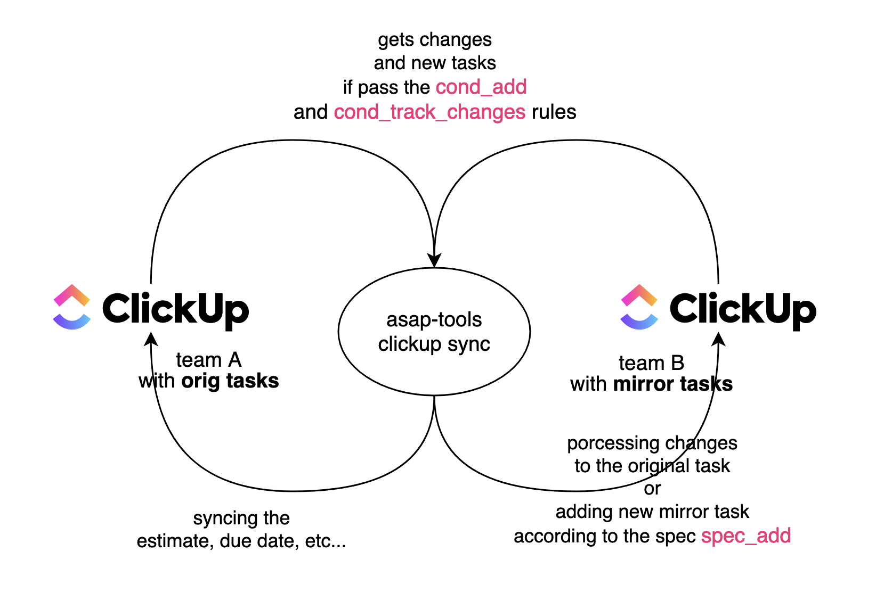

# quick start

Install `asap-tools` via brew

```bash
brew install gebv/tap/asap-tools
# asap-tools-cli -help
```

or download binary files from the [latest release](https://github.com/gebv/asap-tools/releases/latest)

Configuring the spec file (command for example yaml file `asap-tools-cli clickup -debug-example-spec`).

```yaml
mirror_task_rules:
- name: <NameRule>
  # conds for adding new tasks from the team with the original tasks
  cond_add:
    # list folders of interest
    if_in_folders: []
    # list lists of interest
    if_in_lists:
    - https://app.clickup.com/<TeamID>/v/li/<ListID>
    # only the specified task statuses or all tasks
    eq_any_task_status_names: []
    # if assigned task to member
    if_assigned_to_member_email: ""
  # conds for track changes from the team with the original tasks
  cond_track_changes:
    if_in_folders: []
    if_in_lists:
    - https://app.clickup.com/<TeamID>/v/li/<ListID>
    eq_any_task_status_names: []
    if_assigned_to_member_email: ""
  # spec for adding new mirror tasks
  spec_add:
    # mirror tasks are added to the list
    add_to_list: https://app.clickup.com/<TeamID>/v/li/<ListID>
    set_status_name: ""
    assign_to_member_email: ""
```

Set the necessary envs (current on 2021-01-23, show actual envs and command via command `asap-tools-cli -help`)

```csv
KEY                                            TYPE             DEFAULT    REQUIRED    DESCRIPTION
ASAPTOOLS_LOG_DEV                              True or False    false
ASAPTOOLS_LOG_LEVEL                            String           WARN                   Logging level (availabel DEBUG, INFO, WARN, ERROR)
ASAPTOOLS_FIRESTORE_PRIVATE_KEY_INLINE_JSON    String                                  Inline json file with Google Cloud service account private key.
ASAPTOOLS_FIRESTORE_PROJECT_ID                 String                                  Google Cloud project ID
ASAPTOOLS_CLICKUP_API_TOKEN                    String                                  Token from ClickUp API (follow link https://app.clickup.com/settings/apps)
ASAPTOOLS_CLICKUP_FILE_SPEC_SYNC               String
```

Run a command to retrieve changed tasks and processing them.

```bash
asap-tools-cli clickup -recent-activity-sync
```

After each spec file change, run the command (to apply the spec to existing tasks)

```bash
asap-tools-cli clickup -db-sync
```
